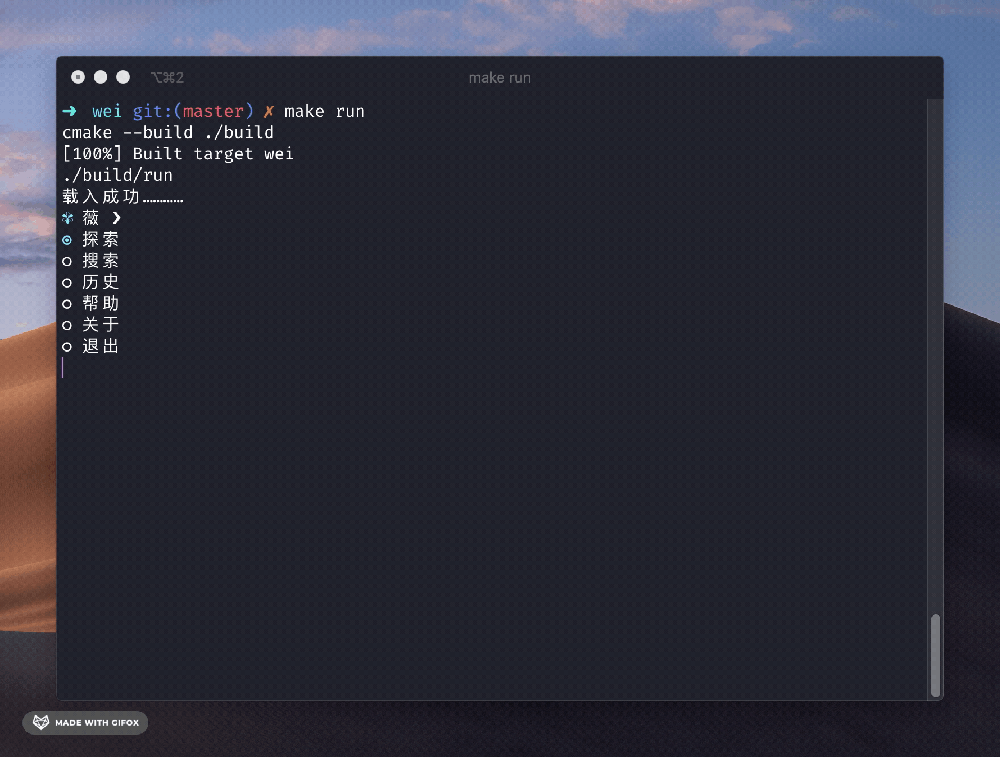

# wei

## 准备

需要 `CMake` 及 `c++` 编译环境。

**编译**

```bash
make
```

**运行**
```bash
make run
```

## 示例

**Explore**


**Search**



## 鸣谢

- [中文诗词](https://github.com/chinese-poetry/chinese-poetry)

- [jute](https://github.com/amir-s/jute)

- [CPM.cmake](https://github.com/TheLartians/CPM.cmake)

- [ModernCppStarter](https://github.com/TheLartians/ModernCppStarter)

## 协议

- [MIT](LICENSE)
